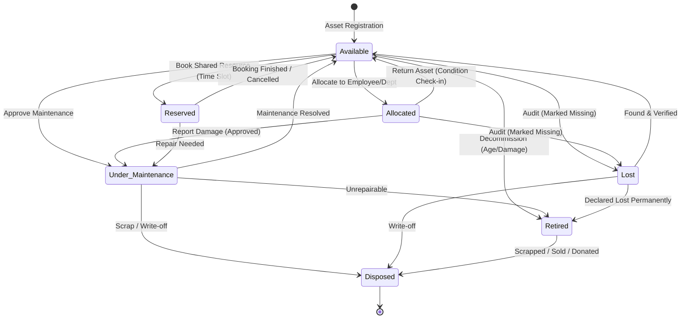
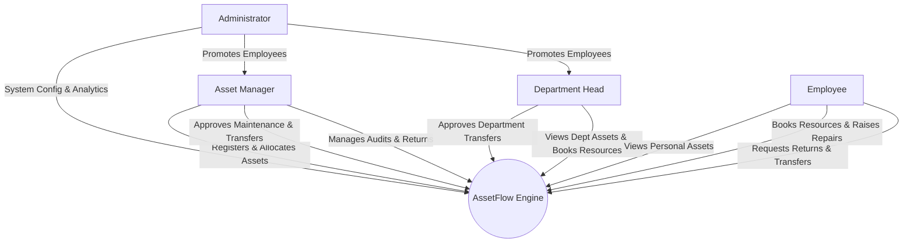
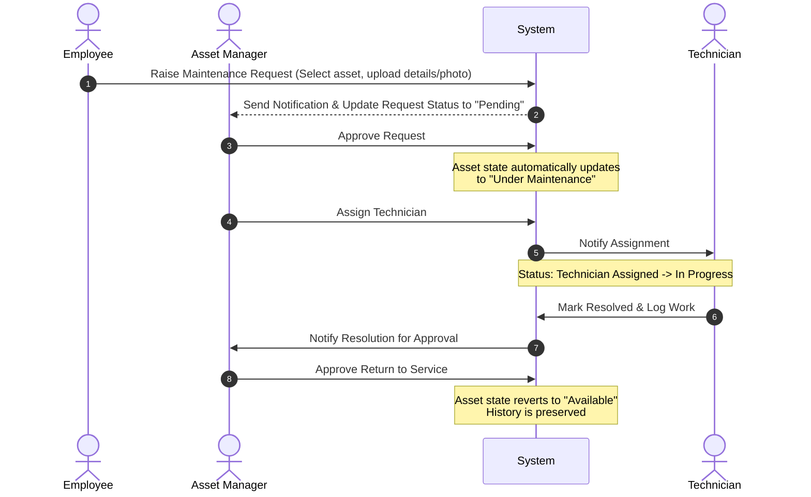
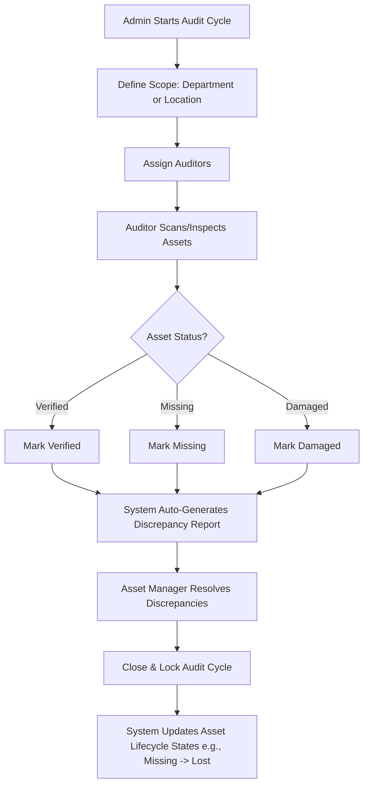

# 📦 AssetFlow: Enterprise Asset & Resource Management System

AssetFlow is a centralized, role-based ERP platform designed to simplify and digitize how organizations track, allocate, and maintain their physical assets and shared resources. By eliminating manual tracking inefficiencies (like spreadsheets and paper logs), AssetFlow provides real-time visibility into asset lifecycles, resource bookings, maintenance requests, and structured audits.

---

## 🌟 Overall Vision

AssetFlow delivers core ERP asset management capabilities with a clean architecture, role-based workflows, and a scalable module design—without the complexity of purchasing, invoicing, or accounting. It is built to serve any organization with equipment, furniture, vehicles, or shared spaces (offices, schools, hospitals, factories, and agencies).

---

## 📐 System Diagrams & Workflows

### 1. Asset Lifecycle State Machine

Assets transition through standard states to maintain strict integrity and prevent double-allocations or scheduling conflicts.



### 2. User Role Hierarchy & Access Matrix

User roles dictate what actions are visible and executable. Accounts are created as generic **Employees** by default, and promoted by **Admins** to their respective administrative roles.



### 3. Maintenance Request Workflow

Before any repair begins, the request must go through an approval pipeline.



### 4. Asset Audit Cycle

Structured audit runs verify physical asset location and condition systematically rather than using loose forms.



---

## 🛠️ Key Features

### 1. Secure Authentication & Promotion

- **Role-Based Access Control (RBAC):** Users signup as basic Employees (no self-assigned Admin roles).
- **Promotion Hub:** Admins promote Employees to **Asset Managers** or **Department Heads** directly from the Employee Directory.

### 2. Live Operational Dashboard

- **Real-time KPIs:** Assets Available, Assets Allocated, Active Maintenance, Active Bookings, Pending Transfers, and Upcoming Returns.
- **Overdue Tracker:** Clearly flags and lists overdue returns separate from upcoming schedule actions.
- **Quick Action Shortcuts:** Register Asset, Book Resource, and Raise Maintenance Request.

### 3. Organization Setup (Admin Only)

- **Department Management:** Structure hierarchy (parent-child), assign Department Heads, and toggle active status.
- **Asset Category Management:** Create categories (Electronics, Furniture, Vehicles) with custom category-specific attributes (e.g., warranty periods).
- **Employee Directory:** Centralized employee master lists for role promotions.

### 4. Asset Directory & Central Registry

- **Auto-generated Asset Tags:** Structured IDs (e.g., `AF-0001`) with serial numbers and QR code mappings.
- **Detailed Records:** Acquisition date, ranking cost, condition state, location tracking, documents/photos, and a "shared/bookable" flag.
- **Historical Timeline:** A ledger of allocation transfers and maintenance actions per asset.

### 5. Conflict-Free Allocation & Transfers

- **Double-Allocation Prevention:** The system blocks allocating an asset already assigned to someone else.
- **Intelligent Transfer Requests:** If an asset is taken, requesting users see who currently holds it and can click a **Transfer Request** to trigger an approval workflow.

### 6. Overlap-Validated Resource Booking

- **Calendar Timeline:** Shows visual booking schedules for shared rooms, vehicles, or equipment.
- **Overlap Validation Engine:** Instantly rejects double-booking time blocks (e.g., booking a room 9:30–10:30 when it is already booked 9:00–10:00).

### 7. Structured Asset Audits

- **Scored Audit Runs:** Cycle lockdown prevents edits once audits are closed, saving complete histories.
- **Auto-Discrepancy Reporting:** Generates alerts for mismatched statuses and guides resolutions.

---

## 💻 Tech Stack (Proposed)

- **Frontend:** React / Vite (HTML5, Vanilla CSS for premium modular styling, custom animations).
- **Backend:** Node.js / Express.js (REST API, WebSockets for live notifications, custom validation middleware).
- **Database:** PostgreSQL or SQLite (Relational structure enforcing cascading rules and unique indexes to prevent double-allocations/bookings).
- **Diagrams:** Mermaid.js (native rendering support).

---

## 📂 Recommended Directory Structure

```text
Asset-Flow/
├── backend/
│   ├── src/
│   │   ├── controllers/      # Request handlers
│   │   ├── middleware/       # RBAC & Conflict validation checks
│   │   ├── models/           # Database schemas (Asset, Booking, Audit)
│   │   ├── routes/           # REST API Endpoints
│   │   └── server.js         # Entry point
│   ├── package.json
│   └── README.md
├── frontend/
│   ├── src/
│   │   ├── components/       # Reusable UI (KPI Card, Calendar, AssetGrid)
│   │   ├── views/            # Dashboard, Setup, Register, Auditing
│   │   ├── assets/           # Premium design styles and custom CSS
│   │   └── App.jsx           # Routing & global state
│   ├── package.json
│   └── index.html
└── README.md                 # Main Project Documentation
```

---

## 🚀 Getting Started

_(Coming soon as the frontend and backend implementations begin!)_
